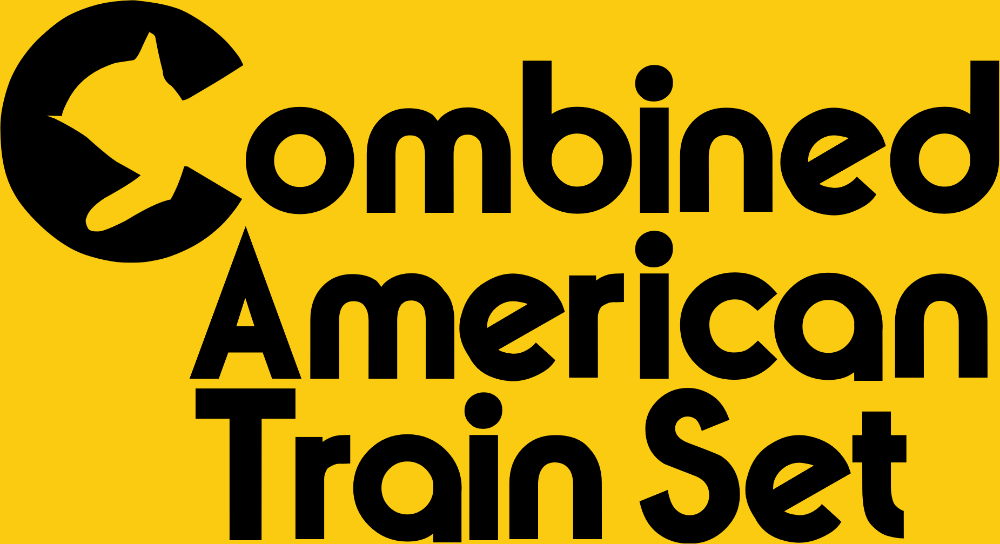

# Combined American Train Set

A North American-themed train set, written in ??? (grf-py or NML).
You can think of it as a NARS successor, but the only real link is the roster and associated vehicle properties.

## Roadmap

See [the roadmap](./doc/ROADMAP.md).

## Credits

- citymania: grf-py
- original NARS devs:
  - graphics, licensed under GPLv2
  - vehicle properties, extracted directly from the GRF

## Licensing

CATS is licensed under [GPLv2](./LICENSE).