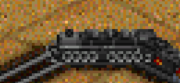

# Combined American Train Set

A North American-themed train set, written in ??? (grf-py or NML).
You can think of it as a NARS successor, but the only real link is the roster and associated vehicle properties.

## Roadmap

### 1.0

Total feature parity with NARS:

- All vehicles implemented, with articulation, MU, and all
- B-units
- Semi-randomized boxcar appearances
- Semi-randomized cargo (when available)
- Cargo-specific car sprites (flatcars, gondolas, hoppers)

### 1.0.1

- Fix 2-8-8-2 Mallet and 4-6-6-4 Challenger having misaligned animation frames when going straight SE after turning left.
  This leads to the front driver of the fixed unit being one quarter turn too early.
  (See `train_30`/`train_31` and `train_41`/`train_42` spritegroups, SE column for the error.)
  -  

### 1.x

Some more features to bring NARS to the modern day.

- More 2cc support. Engines in particular: most don't have 2cc.
- Randomized goods cars, like Iron Horse. For nice-looking random manifests.
- More support for cargos.
- More parameters for tweaking costs.

### 2.x

- Reimplementation of NARS 2.03 features:
  - Regearing
  - Liveries
  - Push-pull
  - Running sounds
  - Mandatory cabooses (new: with parameter)

## Credits

- citymania: grf-py
- original NARS devs:
  - graphics, licensed under GPLv2
  - vehicle properties, extracted directly from the GRF

## Licensing

CATS is licensed under [GPLv2](./LICENSE).