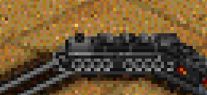
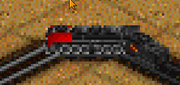

# Roadmap

## 1.0

Total feature parity with NARS:

- All locomotives implemented
  - Steam with tenders
  - Articulated steam with tenders
  - Diesels
  - Diesels with B-units
  - Electrics
  - DMUs/EMUs
  - Locos with specific pax/mail cars
  - Dual-headed locos
- All cars implmented
  - Coaches
    - with dome
    - with trailing coach
  - Mail, express, cabbage cars
  - All freight cars
    - with ending FRED, if available
  - Boxcars
    - with random appearances
  - Reefers
  - Stock cars
  - Hoppers
    - with visible loads
  - Gondolas
    - with visible loads
  - Coil car
    - with visible loads
    - with cover randomization
  - Flat car
    - with visible loads
  - Container, Double-Stack Container
    - with randomized containers
    - with articulation (Double-Stack only)
  - Center Beam
    - with visible cargo
  - Autoracks
    - Older open
    - Modern enclosed
  - Tankers
    - with random appearances
  - Cabooses
    - with FRED, if available

## 1.0.1

- Fix 2-8-8-2 Mallet and 4-6-6-4 Challenger having misaligned animation frames when going straight SE after turning left.
  This leads to the front driver of the fixed unit being one quarter turn too early.
  (See `train_30`/`train_31` and `train_41`/`train_42` spritegroups, SE column for the error.)
  -  

## 1.1

- Company color randomization: (editable by parameter)
  - Every car that supports 1cc should randomly pick from all company colors
  - Every car that supports 2cc should pick random pairs of colors

## 1.x

Some more features to bring NARS to the modern day.

- Randomized cars, like Iron Horse. For nice-looking random manifests.
- More parameters for tweaking costs.
- More 2cc support. Engines in particular: most don't have 2cc.
- More graphics for more cargos.

## x.x

- Reimplementation of NARS 2.03 features:
  - Regearing
  - Liveries
  - Push-pull
  - Running sounds
  - Mandatory cabooses (new: with parameter)